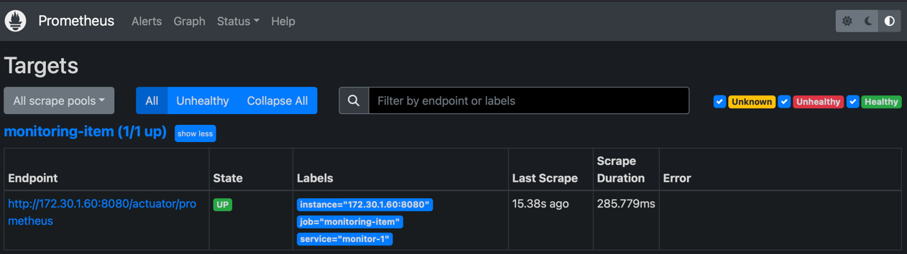
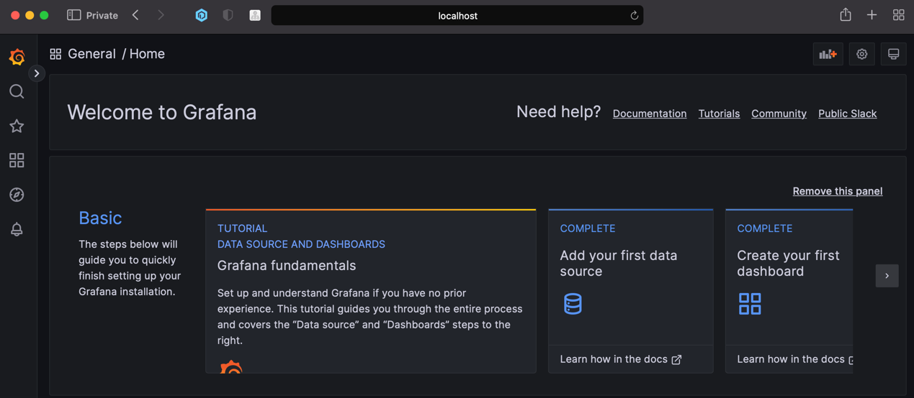
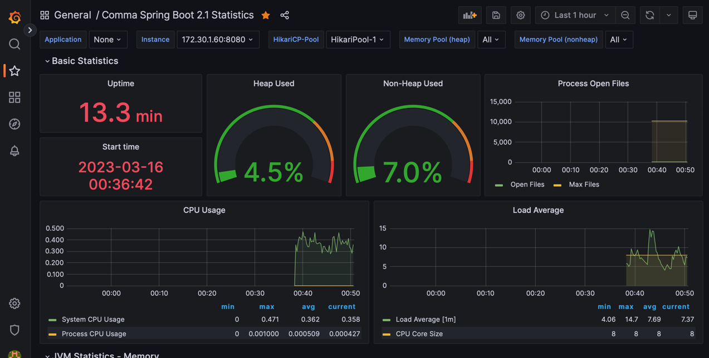

<h1 align="middle"> ❜ </h1>

<br/>

 <p align="middle">업무라는 무한루프 속에서 <br> 지속적인 맺음을 만들어 <br> 지쳐가는 생활에 쉼표를.</p>

<div align="center">
    <p dir="auto">
        <a href="https://donggi-lee-bit.github.io/comma/src/main/resources/static/docs/index.html">
            
        </a>
        <a href="https://github.com/donggi-lee-bit/comma/wiki">
            
        </a>
    </p>
</div>


## 서비스 소개 📝

회고는 새롭게 시작할 수 있는 힘을 주고, 지났던 것들을 평가할 수 있게 합니다.

지난 일들을 확인하고, 지난 일에 대한 감정이나 상황을 스스로 또는 팀원들과 공유하여

앞으로 더 나은 우리가 되기 위해 어떤 것을 해야하는지 찾을 수 있도록 도와줍니다.

---

# 애플리케이션 실행 가이드

- Java 11
- Spring Boot 2.7.6

## 데이터베이스 & 모니터링 프로그램(프로메테우스 그라파나) 실행
- `commaserver/local/monitoring-database` 로 이동
```bash
# 경로 : commaserver/monitor/prometheus-grafana
# 실행 전 Local 환경에 도커가 켜져있어야 합니다.
# 도커 컴포즈를 이용하여 mysql, prometheus, grafana 실행

# 도커 이미지 생성 및 컨테이너 시작
docker compose up -d
# 컨테이너 중지
docker compose stop
# 컨테이너 다시 시작
docker compose start
```

<details>
<summary> 모니터링 연결 확인 </summary>
<div markdown="1">

**Mac OS 를 기준으로 된 설정입니다. Windows 에서 실행할 경우 `docker.for.mac.localhost` 대신 `host.docker.internal` 을 사용합니다.**

1. 브라우저 실행
2. `http://localhost:9090` 로 프로메테우스를 실행합니다. status -> targets 에서 연결을 확인합니다. <br>
   
3. `http://localhost:3000` 로 그라파나를 실행합니다. 처음 실행시 id/pw 를 **admin/admin** 으로 접속합니다. 비밀번호를 한 번 바꾼 뒤 `Welcome To Grafana` 페이지를 보게됩니다. <br>
   
4. 그라파나에서 data source(프로메테우스) 를 연결합니다. 왼쪽 아래의 톱니바퀴를 눌러 `Data sources` 에 접근합니다. Settings 의 HTTP URL에 `http://docker.for.mac.localhost:9090` 을 입력하여 프로메테우스를 연결합니다.
5. 그라파나에서 프로메테우스가 수집한 메트릭을 보기 위해 `Dashboard` 를 띄워주어야합니다. Dashboards -> import 에서 `import via grafana.com` 에 `6756` 을 입력하여 대시보드를 만들어줍니다. (6756은 spring boot statistics 를 보여주는 대시보드 템플릿 id입니다.) <br>
   

</div>
</details>


[](https://hits.seeyoufarm.com)
